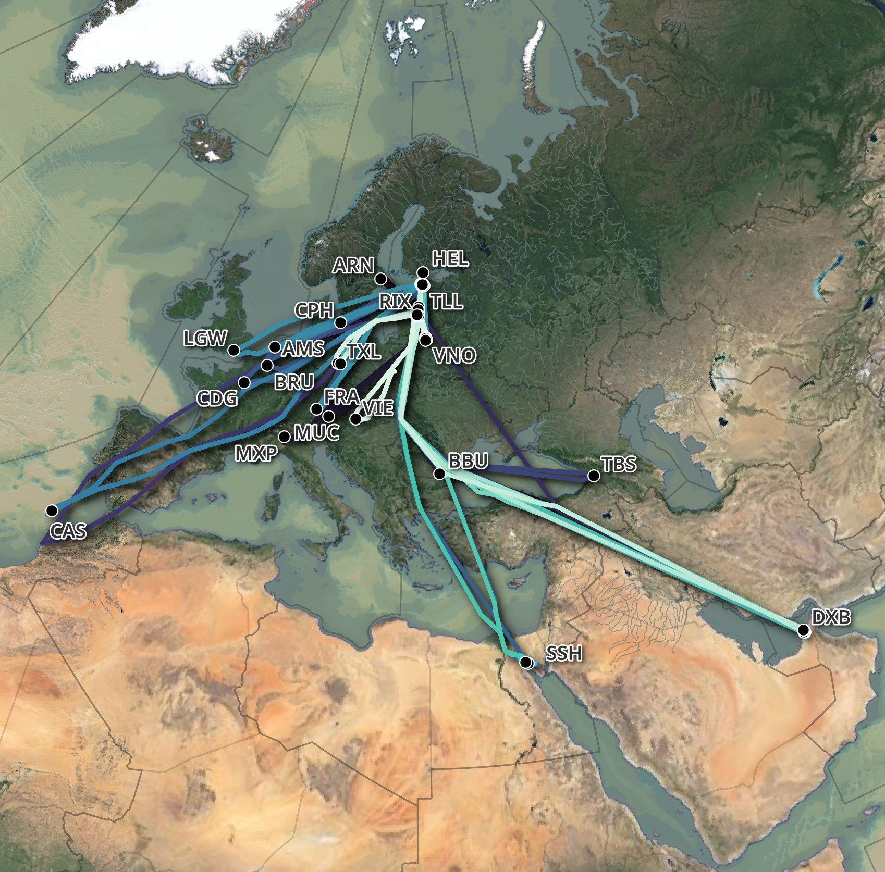

# adsb_json

This script will enrich adsb.lol's feeds and partition them into 1M-line, GZIP-compressed JSONL files. This enrichment can help turn millions of points into a dataset that is easier to work with and analyse.

This script was used in my [Aircraft Route Analysis](https://tech.marksblogg.com/aircraft-route-analysis-adsb.html) blog post to prepare the dataset that produced the following visualisation.



The adsb.lol's dataset covers many parts of the world but it, along with any other ADS-B feed, will have gaps in its global coverage. Below is a map of their coverage for November 19, 2023:


Please read my [Global Flight Tracking](https://tech.marksblogg.com/global-flight-tracking-adsb.html) blog post for instructions on download adsb.lol's daily ADS-B feed.

## Installation

The following should work on Ubuntu and Ubuntu for Windows.

```bash
$ sudo apt update
$ sudo apt install \
    jq \
    pigz \
    python3-pip \
    python3-virtualenv

$ virtualenv ~/.adsb
$ source ~/.adsb/bin/activate

$ git clone https://github.com/marklit/adsb_json ~/adsb_json
$ python -m pip install -r ~/adsb_json/requirements.txt
```

If you're using a Mac, install [Homebrew](https://brew.sh/) and then run the following.

```bash
$ brew install \
    git \
    jq \
    pigz \
    virtualenv

$ virtualenv ~/.adsb
$ source ~/.adsb/bin/activate
$ python -m pip install -r requirements.txt

$ git clone https://github.com/marklit/adsb_json ~/adsb_json
$ python -m pip install -r ~/adsb_json/requirements.txt
```

## Usage Example

The following will download a 1.9 GB TAR file from the adsb.lol project. It will then enrich the data and produce 25 GZIP-compressed, JSON files.

```bash
$ DATE=2024.05.26
$ wget -c "https://github.com/adsblol/globe_history/releases/download/v$DATE-planes-readsb-prod-0/v$DATE-planes-readsb-prod-0.tar"

$ python main.py v2024.05.26-planes-readsb-prod-0.tar
```

Each resulting JSON file should be ~40 MB when GZIP-compressed. Below is an example record.

```bash
$ gunzip -c traces_2024-05-26_0000.jsonl.gz \
    | head -n1 \
    | jq -S .
```

```json
{
  "dbFlags": 0,
  "desc": "ATR-72-600",
  "icao": "5110e9",
  "r": "ES-ATE",
  "reg_details": {
    "description": "general",
    "iso2": "EE",
    "iso3": "EST",
    "nation": "Estonia"
  },
  "t": "AT76",
  "timestamp": "2024-05-26 00:00:00",
  "trace": {
    "aircraft": {
      "alert": null,
      "alt_geom": null,
      "baro_rate": null,
      "category": null,
      "emergency": null,
      "flight": null,
      "geom_rate": null,
      "gva": null,
      "ias": null,
      "mach": null,
      "mag_heading": null,
      "nac_p": null,
      "nac_v": null,
      "nav_altitude_fms": null,
      "nav_altitude_mcp": null,
      "nav_heading": null,
      "nav_modes": null,
      "nav_qnh": null,
      "nic": null,
      "nic_baro": null,
      "oat": null,
      "rc": null,
      "roll": null,
      "sda": null,
      "sil": null,
      "sil_type": null,
      "spi": null,
      "squawk": null,
      "tas": null,
      "tat": null,
      "track": null,
      "track_rate": null,
      "true_heading": null,
      "type": null,
      "version": null,
      "wd": null,
      "ws": null
    },
    "altitude": 850,
    "flags": 1,
    "geometric_altitude": null,
    "geometric_vertical_rate": null,
    "ground_speed": null,
    "h3_5": "8508862ffffffff",
    "indicated_airspeed": null,
    "lat": 59.662093,
    "lon": 17.994374,
    "roll_angle": null,
    "source": "adsb_icao",
    "timestamp": "2024-05-26 08:18:34.550000",
    "track_degrees": null,
    "vertical_rate": null
  }
}
```

## Upgrading Dependencies

If you already have a virtual environment installed then every few weeks, run the following to update the dependencies.

```bash
$ pip install -Ur requirements.txt
```
